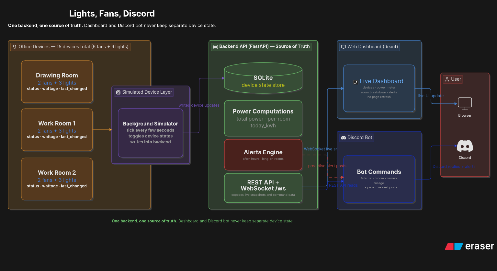

# Lights, Fans, Discord

Preliminary-round hackathon submission for monitoring a small office through one shared backend, a
real-time web dashboard, and a Discord bot.

The project follows the deliverables in
[`docs/Hackathon Problem Statement (Preliminary Round) v1.2.pdf`](docs/Hackathon%20Problem%20Statement%20%28Preliminary%20Round%29%20v1.2.pdf):
simulated electrical-device data, a live web dashboard, a Discord bot, a high-level system diagram,
and a representative hardware schematic.

## What This Builds

- 3 rooms: Drawing Room, Work Room 1, Work Room 2.
- 15 simulated devices total: each room has 2 fans and 3 lights.
- Fans draw 60W when on; lights draw 15W when on.
- FastAPI + SQLite backend is the single source of truth.
- React dashboard updates live through WebSocket snapshots, with REST fallback.
- Discord bot answers from the same backend data and can proactively post alert messages.
- Alerts cover devices left on after office hours and rooms where every fan/light stays on for more
  than 2 hours.

## Deliverables

| Required deliverable | Where it is in this repo |
| --- | --- |
| High-level system diagram | [docs/architecture.png](docs/architecture.png), explained in [docs/architecture.md](docs/architecture.md) |
| Hardware/electrical schematic | [hardware/schematic.png](hardware/schematic.png), source files in [hardware/wokwi/](hardware/wokwi), notes in [hardware/README.md](hardware/README.md) |
| Simulated dynamic device data | [backend/app/simulator.py](backend/app/simulator.py), [backend/app/db.py](backend/app/db.py) |
| Real-time web dashboard | [frontend/](frontend) |
| Discord bot | [backend/app/discord.py](backend/app/discord.py) |
| Single shared backend/API contract | [backend/](backend), [docs/api-contract.md](docs/api-contract.md) |
| Public-codebase setup docs | This README plus component READMEs |

## Final Submission Checklist

- Public repository includes backend, dashboard, bot, docs, and diagrams.
- README explains how to run the backend, dashboard, and Discord bot.
- Demo video is 3 minutes or less.
- Demo video shows the live dashboard, Discord bot commands, and the shared data flow.
- Demo video briefly explains that simulated devices feed one backend, which feeds both the web UI
  and Discord bot.

## Architecture

```text
Simulated room devices
  -> FastAPI backend + SQLite source of truth
  -> WebSocket snapshots for the React dashboard
  -> backend chat/REST paths for the Discord bot
  -> boss/user
```

The backend is the only writer of device state and the only place where power totals, `today_kwh`,
and alerts are computed. The dashboard and Discord bot both read backend-produced data, so they
reflect the same reality.



## Repository Layout

```text
iut-techathon/
├── backend/       FastAPI, SQLite, simulator, alerts, WebSocket, Discord bot
├── frontend/      React + Vite real-time dashboard
├── hardware/      Wokwi ESP32 schematic for one representative room
├── docs/          Architecture, API contract, team notes, problem statement
└── README.md
```

The Discord bot is intentionally in the backend process at `backend/app/discord.py`. FastAPI starts
it during lifespan when `DISCORD_TOKEN` is configured. If `DISCORD_TOKEN` is empty, the backend API
and simulator still run normally.

## Requirements

- Python 3.12+
- [`uv`](https://docs.astral.sh/uv/)
- Node.js 20+
- npm
- Discord bot token only if you want to run the Discord integration
- OpenRouter API key only if you want LLM-humanized bot replies; otherwise the bot uses a real-data
  template fallback

## Run Locally

Start the backend first:

```bash
cd backend
uv sync
cp .env.example .env
uv run python main.py
```

The API runs at `http://localhost:8000`.

Start the dashboard in a second terminal:

```bash
cd frontend
npm install
cp .env.example .env.local
npm run dev
```

The dashboard normally runs at `http://localhost:5173`.

## Discord Bot Setup

The bot uses prefix commands by default:

- `!status`: status summary for all rooms.
- `!room <name>`: status of one room, such as `!room work1`, `!room work room 2`, or `!room drawing`.
- `!usage`: total power right now and today's estimated kWh.
- `!ask <question>`: free-form office question answered from the current backend snapshot.

To enable it, edit `backend/.env` before starting the backend:

```env
DISCORD_TOKEN=your_discord_bot_token
BOT_COMMAND_PREFIX=!
API_BASE=http://localhost:8000

# Optional bonus proactive alerts
ALERT_CHANNEL_ID=your_discord_channel_id
ALERT_POLL_SECONDS=15

# Optional LLM humanization via OpenRouter
OPENROUTER_API_KEY=your_openrouter_key
OPENROUTER_MODEL=meta-llama/llama-3.3-70b-instruct:free
OPENROUTER_BASE_URL=https://openrouter.ai/api/v1
```

Discord Developer Portal settings required for prefix commands:

- Add the bot to your test server.
- Enable **Message Content Intent** for the bot.
- If using proactive alerts, enable Discord Developer Mode and copy the target channel ID into
  `ALERT_CHANNEL_ID`.

The bot never stores its own office state. Commands call `POST /api/chat`, which builds the same
live backend snapshot used by the dashboard before humanizing the response. Proactive alerts poll
`GET /api/alerts` and deduplicate by `alert.id`.

## Useful URLs

- Backend health: `GET http://localhost:8000/health`
- API docs: `http://localhost:8000/docs`
- Devices: `GET http://localhost:8000/api/devices`
- Summary: `GET http://localhost:8000/api/summary`
- History: `GET http://localhost:8000/api/history?minutes=30`
- Alerts: `GET http://localhost:8000/api/alerts`
- Chat: `POST http://localhost:8000/api/chat`
- WebSocket: `ws://localhost:8000/ws`
- Dashboard: `http://localhost:5173`

## Demo Flow

For the final video, the shortest clear path is:

1. Open the dashboard and show the live device status panel, power meter, alerts panel, and office
   layout updating without refresh.
2. In Discord, run `!status`, `!room work2`, and `!usage`.
3. Toggle or wait for device changes, then show that the dashboard and bot reflect the same backend
   state.
4. Trigger an after-hours condition with the demo clock:

```bash
curl -X POST http://localhost:8000/api/demo/clock \
  -H 'Content-Type: application/json' \
  -d '{"iso":"2026-07-03T22:00:00Z"}'
```

5. Show the alert in the dashboard and, if `ALERT_CHANNEL_ID` is configured, the proactive Discord
   alert post.
6. Clear the demo clock when done:

```bash
curl -X POST http://localhost:8000/api/demo/clock \
  -H 'Content-Type: application/json' \
  -d '{"iso":null}'
```

## Hardware Schematic

The hardware deliverable is a Wokwi concept for one representative room: one ESP32 controlling or
sensing 2 fan stand-ins and 3 light stand-ins. The visible LEDs/motors are simulation stand-ins for
real appliances, and the optional current-sense concept is only for realism.


The running app does not depend on physical hardware. Live dashboard and bot values come from the
backend simulator so the full system can be demoed without real devices.

## Validation

Backend syntax check:

```bash
cd backend
python3 -m compileall app main.py
```

Frontend production build:

```bash
cd frontend
npm run build
```

Whitespace check before submission:

```bash
git diff --check
```

Manual acceptance checks:

- `GET /api/devices` returns exactly 15 devices: 6 fans and 9 lights.
- Each room has exactly 2 fans and 3 lights.
- `GET /api/summary.total_power_w` equals the sum of `power_w` for devices that are on.
- Dashboard updates through `WS /ws` without page refresh.
- Bot commands answer from the backend snapshot, not hardcoded values.
- Demo clock can trigger an after-hours alert visible in dashboard and Discord.

## Component Docs

- [Backend README](backend/README.md)
- [Frontend README](frontend/README.md)
- [Hardware README](hardware/README.md)
- [API contract](docs/api-contract.md)
- [Architecture notes](docs/architecture.md)
