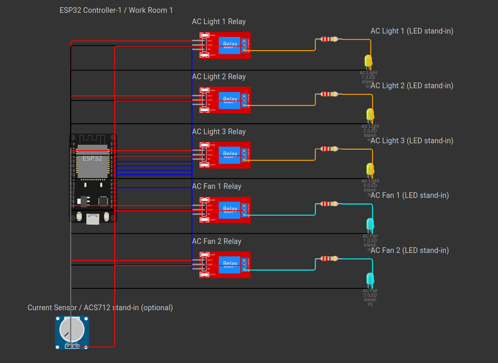

# Lights, Fans, Discord

Hackathon preliminary-round project for monitoring a small office through one shared backend, a
real-time web dashboard, and a Discord bot.

The fixed office model is:

- 3 rooms: Drawing Room, Work Room 1, Work Room 2.
- Each room has 2 fans, 3 lights, and 1 controller.
- Total monitored devices: 18.
- Fans use 60W when on, lights use 15W when on, controllers report 0W and use `online`/`offline`.

## Architecture

```text
Simulated room devices
  -> FastAPI backend + SQLite source of truth
  -> WebSocket snapshots for the React dashboard
  -> REST reads for the Discord bot
```

The backend is the only writer of device state and the only place where power totals, `today_kwh`,
and alerts are computed. The dashboard and Discord bot must read from the backend so they never
disagree.

## Repository Layout

```text
iut-techathon/
├── backend/       FastAPI + SQLite API
├── frontend/      React + Vite dashboard
├── hardware/      Wokwi ESP32 schematic (concept for one room)
├── docs/          Team plan, architecture, fixed API contract, problem statement
└── README.md
```

Planned folders:

```text
bot/               Discord bot using REST API
```

## Fixed Contract

The team must build against [docs/api-contract.md](docs/api-contract.md). That file defines:

- REST endpoint paths and response wrappers.
- WebSocket `snapshot` shape.
- Device IDs and enum values.
- Alert types: `after_hours`, `long_on`, `controller_offline`.
- Demo controls for clock override, simulator pause/resume, and manual device state changes.
- Canonical mock JSON fixtures for parallel frontend/bot work.

Do not change public API shapes casually. If the contract changes, update the docs first and tell
the team before anyone continues implementation.

## Run Locally

Backend:

```bash
cd backend
uv sync
uv run python main.py
```

The API runs at `http://localhost:8000`.

Frontend:

```bash
cd frontend
npm install
npm run dev
```

The Vite dev server normally runs at `http://localhost:5173`.

## Key URLs

- Backend health: `GET http://localhost:8000/health`
- API docs: `http://localhost:8000/docs`
- Devices: `GET http://localhost:8000/api/devices`
- Summary: `GET http://localhost:8000/api/summary`
- Alerts: `GET http://localhost:8000/api/alerts`
- WebSocket: `ws://localhost:8000/ws`

## Hardware Schematic

A Wokwi ESP32 schematic for one representative room (1 controller + 2 fans + 3 lights),
showing an electrically sensible relay-driven control design for all five AC loads. The visible
LEDs/motors in Wokwi are stand-ins for real mains appliances. It is a **concept/simulation only**
and does not feed the running app — the live demo uses simulated data in the backend.



See [`hardware/README.md`](hardware/README.md) for the pin map, wiring rationale, and how to
open it in Wokwi. The optional sensor shown there is a realism/bonus concept only; live office
power totals for the dashboard and bot come from the backend's simulated device data.

## Team Ownership

- Saima: backend simulator, SQLite state, REST API, WebSocket snapshots, alerts.
- Arif: React dashboard, live panels, power meter, alerts panel, office layout.
- Jifat: Discord bot, REST client, commands, LLM humanization, proactive alert posts.
- Sadi: API contract, diagrams, circuit schematic, README, integration, demo video.

## Validation Checklist

- `GET /api/devices` returns exactly 18 devices: 6 fans, 9 lights, 3 controllers.
- Each room has exactly 2 fans, 3 lights, and 1 controller.
- `GET /api/summary.total_power_w` equals the sum of fan/light `power_w`.
- Dashboard updates from `WS /ws` without refresh.
- Bot commands read REST data from the same backend.
- Demo clock override can trigger an after-hours alert visible in both dashboard and bot.
